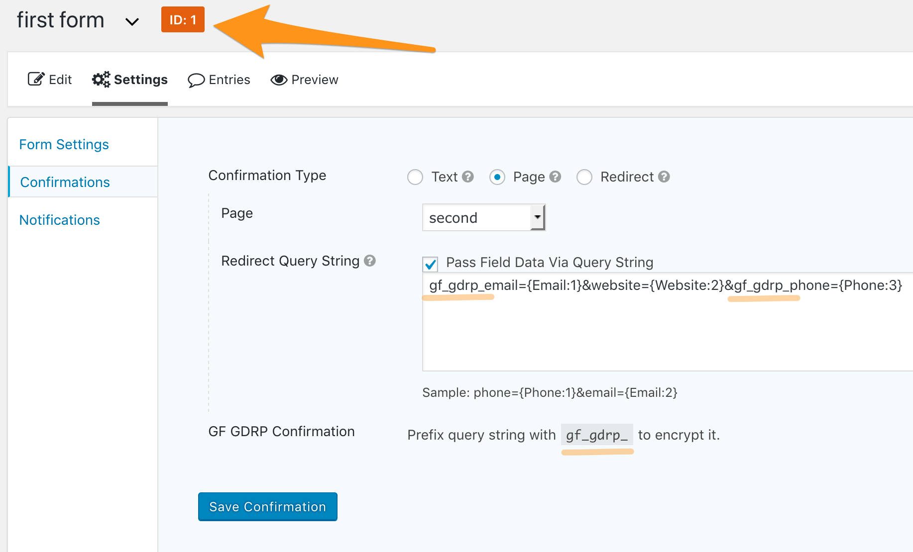
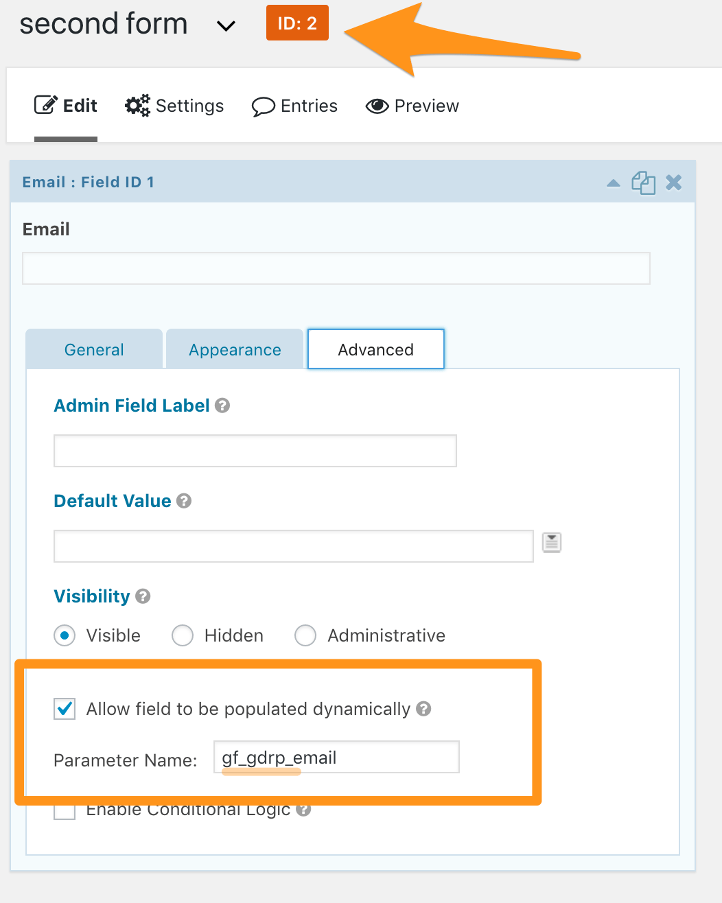

# gf-gdrp-confirmation

[](https://packagist.org/packages/itinerisltd/gf-gdrp-confirmation)
[](https://packagist.org/packages/itinerisltd/gf-gdrp-confirmation)
[](https://packagist.org/packages/itinerisltd/gf-gdrp-confirmation)
[](https://github.com/ItinerisLtd/gf-gdrp-confirmation/blob/master/LICENSE)
[](https://www.itineris.co.uk/contact/)


Encrypt personal information in query string and pre-populate them to Gravity Forms fields.

<!-- START doctoc generated TOC please keep comment here to allow auto update -->
<!-- DON'T EDIT THIS SECTION, INSTEAD RE-RUN doctoc TO UPDATE -->


- [Minimum Requirements](#minimum-requirements)
- [Installation](#installation)
- [Usage](#usage)
- [FAQ](#faq)
  - [Am I GDPR-compliant just by activating this plugin?](#am-i-gdpr-compliant-just-by-activating-this-plugin)
  - [Will you add support for older PHP versions?](#will-you-add-support-for-older-php-versions)
  - [It looks awesome. Where can I find some more goodies like this?](#it-looks-awesome-where-can-i-find-some-more-goodies-like-this)
  - [This plugin isn't on wp.org. Where can I give a ⭐️⭐️⭐️⭐️⭐️ review?](#this-plugin-isnt-on-wporg-where-can-i-give-a-%EF%B8%8F%EF%B8%8F%EF%B8%8F%EF%B8%8F%EF%B8%8F-review)
  - [Code Style](#code-style)
- [Feedback](#feedback)
- [Security](#security)
- [Change log](#change-log)
- [Credits](#credits)
- [License](#license)

<!-- END doctoc generated TOC please keep comment here to allow auto update -->

## Goal

[Using confirmation query strings to populate a form based on another submission](https://docs.gravityforms.com/confirmation-query-string-populate-form/) is a powerful feature of [Gravity Forms](https://www.gravityforms.com/).
However, putting personal information in query strings violates GDPR and leaks user information to third parties(e.g: Google Analytics).
This plugin encrypt the query strings and pre-populate them to Gravity Forms fields.

> You will not and will not assist or permit any third party to, pass information to Google that Google could use or recognize as personally identifiable information.
>
> --- https://www.google.com/analytics/terms/us.html

Learn more on:
- [https://support.google.com/analytics/answer/7686480](https://support.google.com/analytics/answer/7686480)
- [https://support.google.com/analytics/answer/6366371](https://support.google.com/analytics/answer/6366371)

## Minimum Requirements

- PHP v7.2
- WordPress v4.9.8
- [Gravity Forms](https://www.gravityforms.com/) v2.3.6.8
- [OpenSSL extensions (version 1.0.1 or later) enabled](https://github.com/defuse/php-encryption#dependencies)

## Installation

```bash
$ composer require itinerisltd/gf-gdrp-confirmation
```

## Usage





## FAQ

### Am I GDPR-compliant just by activating this plugin?

No, this plugin is meant to assist a Controller, Data Processor, and Data Protection Officer (DPO) with efforts to meet the obligations and rights enacted under the GDPR.

Activating this plugin does not guarantee that an organisation is successfully meeting its responsibilities and obligations of GDPR. 
Organisations should assess their unique responsibilities and ensure extra measures are taken to meet any obligations required by law and based on a data protection impact assessment (DPIA).

Consult legal professionals before using this plugin and review plugin source code.

### Will you add support for older PHP versions?

Never! This plugin will only works on [actively supported PHP versions](https://secure.php.net/supported-versions.php).

Don't use it on **end of life** or **security fixes only** PHP versions.

### It looks awesome. Where can I find some more goodies like this?

- Articles on [Itineris' blog](https://www.itineris.co.uk/blog/)
- More projects on [Itineris' GitHub profile](https://github.com/itinerisltd)
- Follow [@itineris_ltd](https://twitter.com/itineris_ltd) and [@TangRufus](https://twitter.com/tangrufus) on Twitter
- Hire [Itineris](https://www.itineris.co.uk/services/) to build your next awesome site

### This plugin isn't on wp.org. Where can I give a ⭐️⭐️⭐️⭐️⭐️ review?

Thanks! Glad you like it. It's important to make my boss know somebody is using this project. Instead of giving reviews on wp.org, consider:

- tweet something good with mentioning [@itineris_ltd](https://twitter.com/itineris_ltd)
- star this Github repo
- watch this Github repo
- write blog posts
- submit pull requests
- [hire Itineris](https://www.itineris.co.uk/services/)

### Code Style

Check your code style with `$ composer check-style`. It's a mix of PSR-1, PSR-2, PSR-4 and [WordPress Coding Standards](https://github.com/WordPress-Coding-Standards/WordPress-Coding-Standards). Learn more on [itineris-wp-coding-standards](https://github.com/ItinerisLtd/itineris-wp-coding-standards)
Change [phpcs.xml](./phpcs.xml) when necessary.

## Feedback

**Please provide feedback!** We want to make this library useful in as many projects as possible.
Please submit an [issue](https://github.com/ItinerisLtd/gf-gdrp-confirmation/issues/new) and point out what you do and don't like, or fork the project and make suggestions.
**No issue is too small.**

## Security

If you discover any security related issues, please email [hello@itineris.co.uk](mailto:hello@itineris.co.uk) instead of using the issue tracker.

## Change log

Please see [CHANGELOG](./CHANGELOG.md) for more information on what has changed recently.

## Credits

[gf-gdrp-confirmation](https://github.com/ItinerisLtd/gf-gdrp-confirmation) is a [Itineris Limited](https://www.itineris.co.uk/) project created by [Tang Rufus](https://typist.tech).

Full list of contributors can be found [here](https://github.com/ItinerisLtd/gf-gdrp-confirmation/graphs/contributors).

## License

[gf-gdrp-confirmation](https://github.com/ItinerisLtd/gf-gdrp-confirmation) is released under the [MIT License](https://opensource.org/licenses/MIT).
